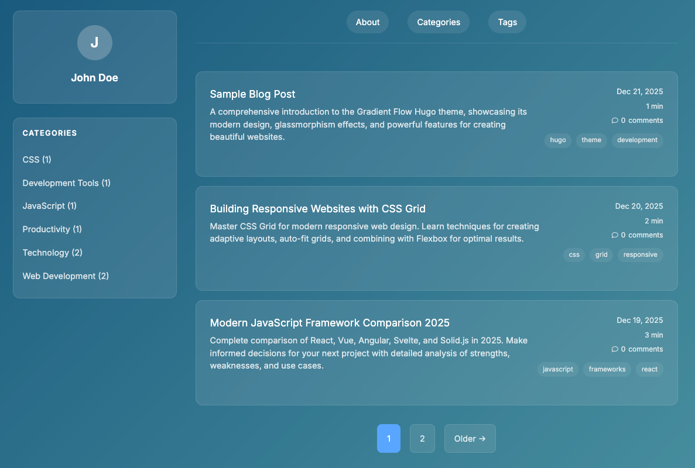

# Gradient Flow Hugo Theme

A modern, responsive Hugo theme with beautiful gradient backgrounds and glassmorphism effects.



## ✨ Features

- **🎨 Modern Gradient Design**: Configurable gradient backgrounds with glassmorphism effects
- **📱 Responsive Layout**: Adapts perfectly to desktop, tablet, and mobile
- **🎯 Content-Focused**: Typography and layout optimized for reading
- **🎛️ Highly Configurable**: Easy customization of colors, fonts, and features
- **🌍 i18n Support**: Multi-language support built-in
- **♿ Accessibility**: WCAG compliant design patterns
- **🏷️ Categories**: Organized content navigation
- **🔗 Social Integration**: Built-in social media links
- **💬 Comments**: Disqus integration support
- **📊 Analytics**: Google Analytics support

## 🚀 Installation

1. Add this theme to your Hugo site:
   ```bash
   cd themes
   git clone https://github.com/hpcsc/gradient-flow-theme.git gradient-flow
   ```

2. Update your site's `config.toml`:
   ```toml
   theme = "gradient-flow"
   ```

## ⚙️ Configuration

The theme is highly configurable through your site's `config.toml`:

```toml
[params]
    # Theme Colors (customize your look)
    primaryColor = "#58a6ff"       # Accent color for links, highlights
    secondaryColor = "#13547A"   # Gradient start color
    tertiaryColor = "#70BEBC"     # Gradient end color
    textColor = "#ffffff"          # Main text color
    backgroundBlur = "rgba(19, 84, 122, 0.3)"  # Background blur effect
    
    # Typography
    fontFamily = "-apple-system, BlinkMacSystemFont, 'Segoe UI', Roboto, sans-serif"
    codeFont = "'SF Mono', Monaco, 'Cascadia Code', monospace"
    
    # Author Information
    [params.author]
    name = "Your Name"
    description = "Your professional bio"
    avatar = "/path/to/avatar.jpg"  # Optional: URL to avatar image
    email = "your-email@example.com"  # Optional: For Gravatar
    
    # Social Media
    [params.social]
    github = "username"
    linkedin = "username"
    codeproject = "username"
    
    # Analytics
    googleAnalytics = "GA-TRACKING-ID"
    disqusShortname = "site-disqus"
    
    # Custom Assets (arrays of strings)
    params.customCSS = ["/css/custom.css"]
    params.customJS = ["/js/custom.js"]
    
    # Other
    favicon = "/favicon.ico"  # Optional
```

## 🎨 Customization Examples

### Dark Tech Theme
```toml
[params]
    primaryColor = "#00b4d8"
    secondaryColor = "#1a1a1a"
    tertiaryColor = "#0d1117"
```

### Ocean Theme
```toml
[params]
    primaryColor = "#00b4d8"
    secondaryColor = "#0077be"
    tertiaryColor = "#00a8cc"
```

### Purple Gradient
```toml
[params]
    primaryColor = "#8b5cf6"
    secondaryColor = "#6d28d9"
    tertiaryColor = "#a855f7"
```

## 📱 Layout Structure

### Home Page
- Site header with title and tagline
- Left sidebar with author profile and categories
- Main content area with post cards
- Each post shows title, date, tags, and excerpt

### Post Page
- Clean navigation breadcrumb
- Sidebar with categories and related posts
- Full-width post content with optimized typography
- Post-specific tags display
- Code highlighting with theme-matching colors

## 🌍 Internationalization

Supports multiple languages with `i18n/` files. Current translations:
- English (default)

## 📄 License

MIT License - see [LICENSE](https://github.com/hpcsc/gradient-flow-theme/blob/main/LICENSE) for details.

---

Built with ❤️ for the Hugo community
